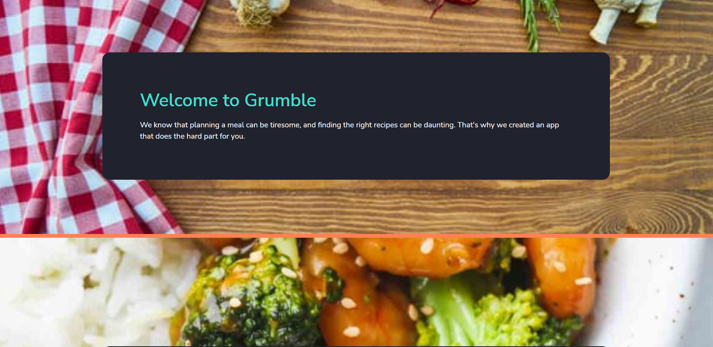
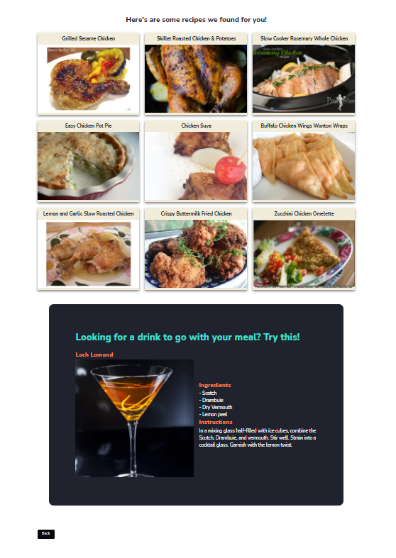
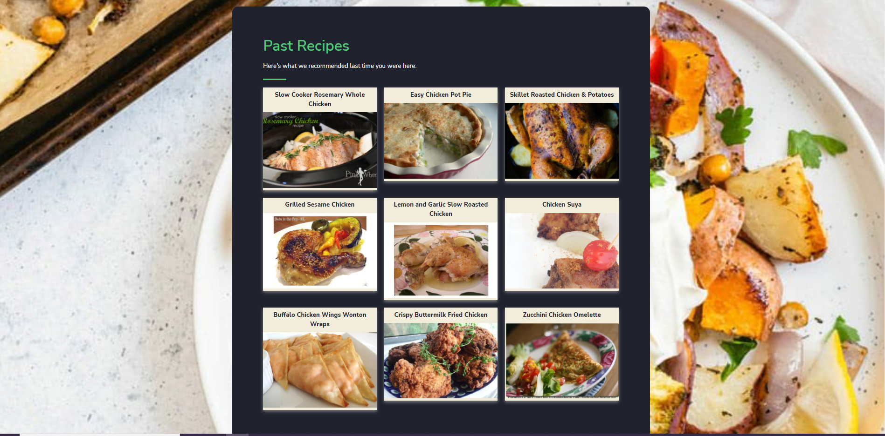

# Project-1
## Description 
Grumble is a simple application that helps you plan out your meals when you just can’t decide what to eat based on what ingredients you already have at home.
It’s efficient and easy to use. No more wasting time debating, pondering, and wondering what’s for dinner. Grumble takes the stress out of cooking. Meals are based on the ingredients you have on hand. Simply give it a list of items, and Grumble will generate recipes with the ingredients in your fridge! Want a drink with that too? Feeling adventurous? Grumble also generates a random cocktail recipe to go with your meal. A new experience for you to try to go along with your stress-free, carefully chosen recipes. Don’t like that option? Grumble allows you to generate cocktail recipes multiple times to find a cocktail you want to try. You’ll never go hungry again. You’ll never need to stress over dinner again. Need a recipe? Choose Grumble! 

## UI Mockup

## APIs Used
* Spoonacular API (Food recipe)
* CocktailDB (Drink recipe)

## User Story
When I add an ingredient to the search bar and press add ingredient, I see that ingredient gets added to the list of ingredients.

When I click a checkbox, it includes that ingredient in the recipe search

When I click on find recipes, I am presented with a list of recipe recommendations based on the ingredients included in the list as well as a random cocktail and it’s instructions/ingredients to go along with my meal.

When I click on one of the recipe images, I am brought to a separate website which has the recipe instructions.

When I press back on the recipe page, I am presented with the home page again.

When I scroll down, I am presented with a past recipe section that includes the most recent recipes I searched for.

## Group-3 Team Members
* Tristan Crain 
* Dalia Farag 
* Rochelle Younger 

## Application Wireframe 
### Grumble DataFlow

## Deployed Application

https://rochelleyounger.github.io/Project_Grumble/